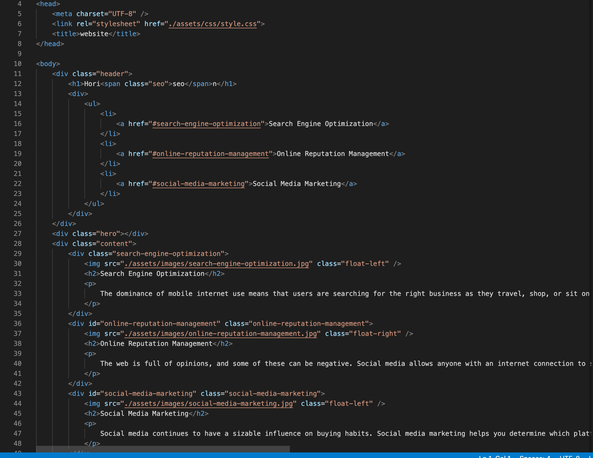

# Horiseon Search Engine Optimization Project

## Description

My project was to optimize the Horiseon Social Solution Services website for search engines. Regarding the optimization, I was given a list of criteria to optimize for them.

- WHEN I view the source code
    - THEN I find semantic HTML elements
- WHEN I view the structure of the HTML elements
    - THEN I find that the elements follow a logical structure independent of styling and positioning
- WHEN I view the image elements
    - THEN I find accessible alt attributes
- WHEN I view the heading attributes
    - THEN they fall in sequential order
- WHEN I view the title element
    - THEN I find a concise, descriptive title

The original site code was set up like this:

In this screenshot, you can see that there are unecessary classes, the title tells you nothing about the website, and that search-engine-optimization id is completely missing. To properly optimize the website, this project required me to clean up a lot of the code and fix and add any missing functions. After editing the code and adding the missing functons, my website's code looks like this:

In this screenshot, you can see that I have created a better title and included a meta description to help the website have a greater visibility in search engines. Additionally, I have fixed the ID issue, as well as having removed the unecessary classes and replaced them with appropiate tags or more condensed classes. 

Referencing the acceptance criteria, I am at a point where I have completed most of them. In the next screenshot, you will see my already updated CSS style sheet. In this style sheet you will see that I have updated all of the terms to match the new HTML tags and classes as well as add a few additional cosmetic changes.

As you can see I have added a hover feature to the nav bar as well as reduced the image size to increase the site's load time. While the hover feature is purely cosmetic, the reduced image also helps with search engine optimization as google's crawler, the googlebot, will have to spend less time trying to load the webpage and be able to travel across the site more quickly and keep it updated on their search engine. 

Attched below is a link to live website where you can see the changes I have made in action:

[Horiseon Social Solution Services](https://morrisbianco.github.io/seo-horiseon-project/)